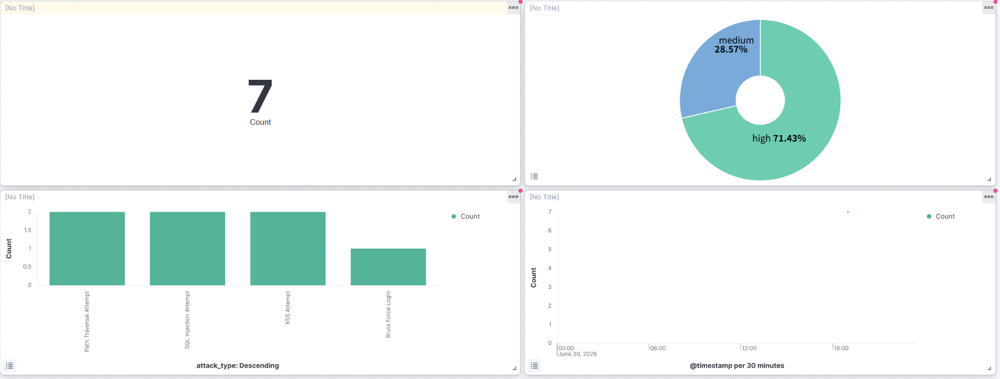

# SecureLogPipe

> DevSecOps 보안 파이프라인과 Elastic 기반 웹 공격 탐지·알림 시스템

Flask 웹앱에서 발생하는 공격성 요청 로그를 Python으로 탐지하고, 탐지 결과를 Elasticsearch에 저장해 Kibana로 시각화하며, 위험 이벤트는 Slack/Discord로 알림을 보내는 DevSecOps 포트폴리오 프로젝트입니다.

---

## 아키텍처

```
[GitHub Push]
      ↓
[GitHub Actions Security Pipeline]
      ├─ Secret Scan: Gitleaks
      ├─ SAST: Bandit
      ├─ Container Scan: Trivy
      └─ Detector Test

[Local Docker Demo]
      ├─ Flask Web App (access.log 생성)
      ├─ Python Detector (rules.yml 기반 탐지)
      │    ├─ detection_report.json 저장
      │    ├─ Elasticsearch 적재
      │    └─ Slack/Discord 알림
      ├─ Elasticsearch
      └─ Kibana Dashboard
```

---

## 탐지 시나리오

| Rule ID | 시나리오 | Severity |
|---|---|---|
| SQLI-001 | SQL Injection 탐지 | High |
| XSS-001 | XSS 탐지 | Medium |
| PATH-001 | Path Traversal 탐지 | High |
| BF-001 | Brute Force 로그인 탐지 | High |

---

## 기술 스택

| 영역 | 기술 |
|---|---|
| Web App | Flask |
| Container | Docker, Docker Compose |
| CI/CD | GitHub Actions |
| Secret Scan | Gitleaks |
| SAST | Bandit |
| Image Scan | Trivy |
| Log Detection | Python |
| Rule 관리 | YAML |
| Search/Storage | Elasticsearch 8.x |
| Visualization | Kibana |
| Alert | Slack / Discord Webhook |

---

## 실행 방법

### 1. Docker로 전체 스택 실행

```bash
docker compose up
```

- Flask 앱: http://localhost:5000
- Kibana: http://localhost:5601

### 2. 공격 트래픽 생성

```bash
# SQL Injection
curl "http://localhost:5000/search?q='%20OR%20'1'='1"

# XSS
curl "http://localhost:5000/search?q=<script>alert(1)</script>"

# Path Traversal
curl "http://localhost:5000/search?q=../../etc/passwd"

# Brute Force (6회 반복)
for i in {1..6}; do
  curl -X POST http://localhost:5000/login \
    -d "username=admin&password=wrong"
done
```

### 3. 탐지기 실행

```bash
python3 detector/detect.py logs/access.log
```

결과: `reports/detection_report.json`

### 4. Elasticsearch 적재

```bash
python3 detector/index_to_elastic.py reports/detection_report.json
```

### 5. 알림 전송 (Slack/Discord)

```bash
WEBHOOK_URL=https://hooks.slack.com/... python3 detector/alert.py reports/detection_report.json
# Discord의 경우
WEBHOOK_URL=https://discord.com/api/webhooks/... WEBHOOK_TYPE=discord python3 detector/alert.py reports/detection_report.json
```

---

## Kibana 대시보드



---

## GitHub Actions 파이프라인

Push 시 자동 실행:

1. Python syntax check
2. Bandit SAST
3. Gitleaks Secret Scan
4. Docker image build
5. Trivy Container Scan
6. Detector 실행 테스트
7. Report artifact 업로드

---

## 디렉토리 구조

```
securelog-pipe/
├── app/
│   ├── app.py
│   ├── requirements.txt
│   └── Dockerfile
├── detector/
│   ├── detect.py
│   ├── alert.py
│   ├── index_to_elastic.py
│   ├── rules.yml
│   └── sample_access.log
├── logs/
├── reports/
├── docs/
│   └── kibana-dashboard.png
├── .github/
│   └── workflows/
│       └── security-pipeline.yml
├── docker-compose.yml
└── .gitignore
```
